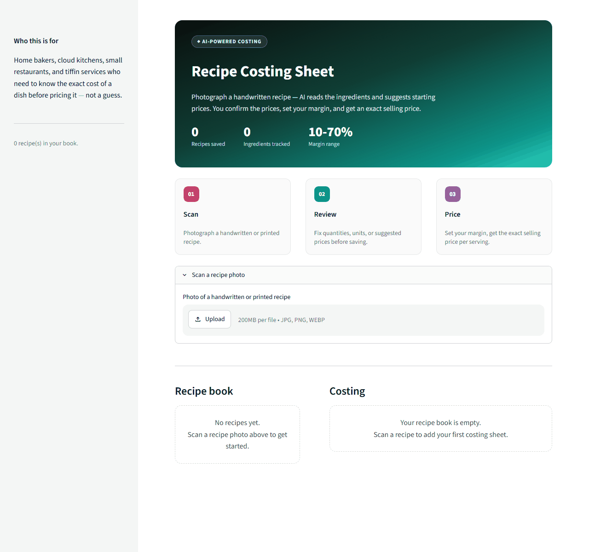
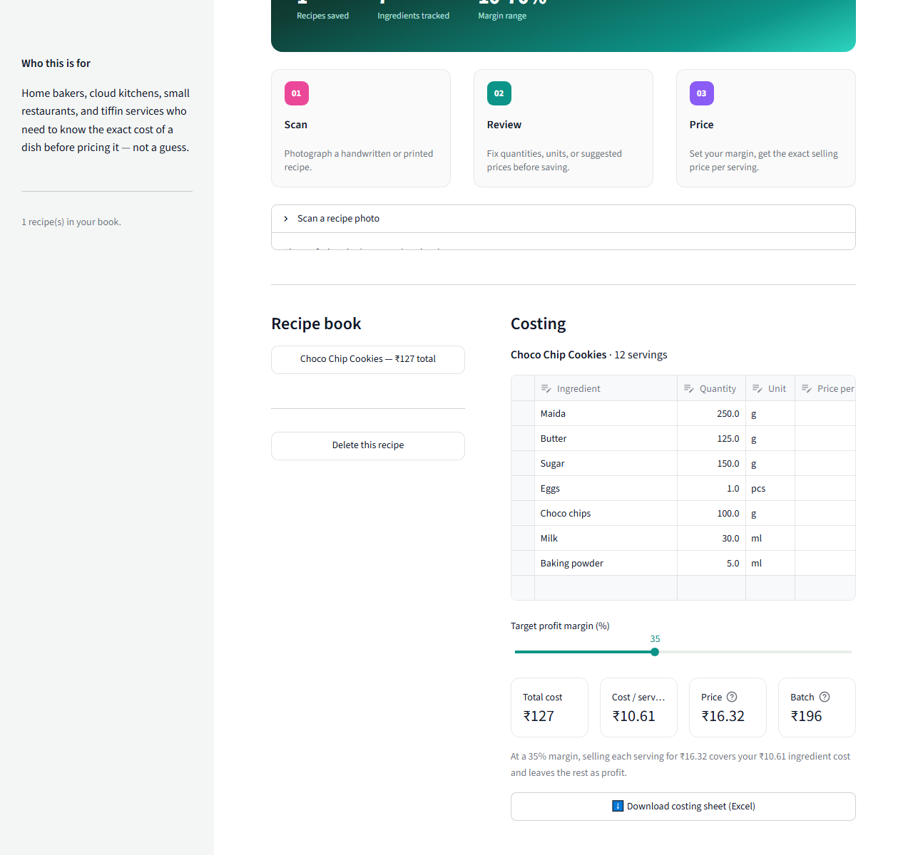

<div align="center">

# Recipe Costing Sheet

[](https://git.io/typing-svg)

[](https://www.python.org/)
[](https://streamlit.io/)
[](https://console.groq.com/)
[](https://openpyxl.readthedocs.io/)

</div>

Home bakers and cloud kitchens usually price a dish by gut feeling — "₹300 sounds about
right" — because working out the exact ingredient cost by hand is tedious. **Recipe
Costing Sheet** does the math:

- Photograph a handwritten (or printed) recipe — AI reads every ingredient, normalizes
  quantities to grams/millilitres/pieces, and even suggests a realistic starting price per
  kg/litre/piece so you're not starting from a blank sheet.
- Review and correct quantities, units, and prices before saving (AI-suggested prices are a
  starting point, not gospel — local prices vary).
- Every recipe is saved to a persistent **recipe book** — build up a costing library over
  time, revisit and reprice any dish as ingredient costs change.
- Pick a target profit margin (10–70%) and get the exact **suggested selling price** per
  serving and per batch.
- Export any recipe's full costing sheet to Excel (ingredients + cost breakdown + summary).

**Who pays:** Home bakers, cloud kitchens, small restaurants, tiffin services —
₹199–499/month.

## Demo

A real run: photograph a handwritten "Choco Chip Cookies" recipe card, the AI reads all 7
ingredients (with unit-normalized quantities and starting prices), review/save it, then set
a margin and get the exact selling price per serving and per batch.



<details>
<summary>Full costing sheet screenshot</summary>



</details>

## Stack

- **Streamlit** — recipe-book list + live costing sheet detail view
- **Groq** (`qwen/qwen3.6-27b`) — recipe photo → structured ingredient list with unit
  normalization and starting price suggestions
- **Pandas + openpyxl** — editable pricing table + Excel export

## Local setup

```bash
cd "12 project"
pip install -r requirements.txt
cp .env.example .env   # add your GROQ_API_KEY (free at console.groq.com)
streamlit run app.py
```

Runs on `http://localhost:8501`.

## Project structure

```
12 project/
├── app.py               Streamlit UI — scan panel, recipe book, costing sheet
├── vision.py              Groq Vision call + prompt/schema for recipe OCR
├── storage.py              Flat JSON persistence for the recipe book
├── data/                   recipes.json lives here (created on first save)
├── sample_images/          (drop a demo recipe photo here for testing)
├── requirements.txt
└── .env.example
```

## Notes for the portfolio writeup

- Ingredient quantities are normalized to one of three base units (grams, millilitres,
  pieces) at extraction time, so cost math is always `(quantity / 1000) × price-per-kg-or-L`
  or `quantity × price-per-piece` — no unit-conversion edge cases scattered through the UI.
- The AI's `typical_price_per_unit` guess exists purely to save typing — it's clearly a
  starting default the user is expected to correct, not a live price feed.
- The pricing table is directly editable and changes save immediately (no separate "save"
  step), since adjusting a price is the core interaction, not an edge case.
